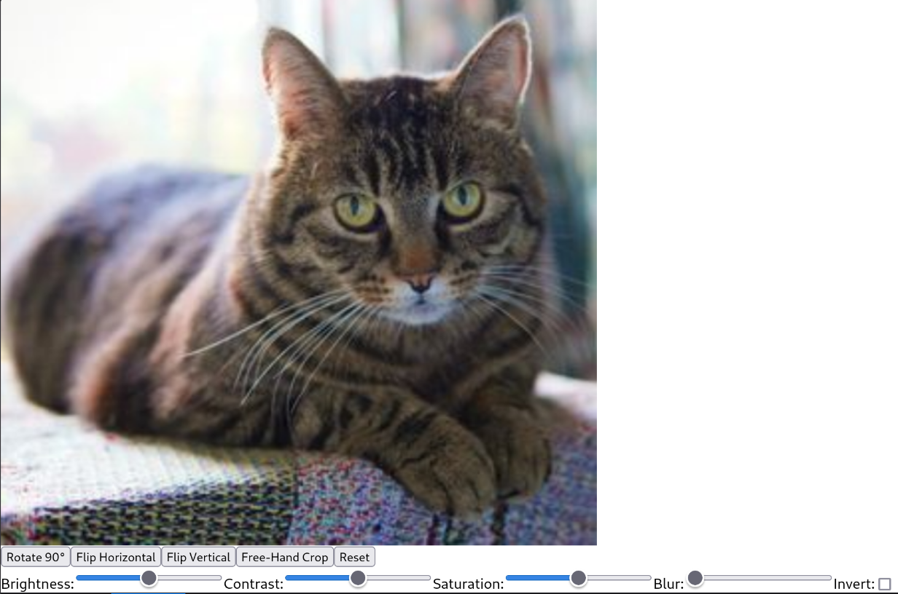

# @ente-io/photo-editor-sdk Demo App



This project demonstrates the usage of the `@ente-io/photo-editor-sdk` in a React application. It showcases various features of the SDK, including image transformation, color adjustment, and free-hand cropping.

## Setup

If you want to use the published npm package:

1. Install the package:

   ```
   npm install @ente-io/photo-editor-sdk
   ```

   For development, you can point to your dev branch:

   ```
   npm install github:your-username/photo-editor-sdk#your-dev-branch
   ```

## Running the Demo

After setting up, you can run the demo app:

```
npm run dev
```

This will start the development server. Open [http://localhost:5137](http://localhost:5137) to view the app in your browser.

## Features Demonstrated

- Image rotation and flipping
- Color adjustments (brightness, contrast, saturation, blur, invert)
- Free-hand cropping

## Learn More

For more information about the `@ente-io/photo-editor-sdk`, please refer to its documentation.
